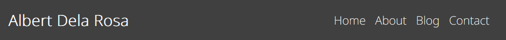
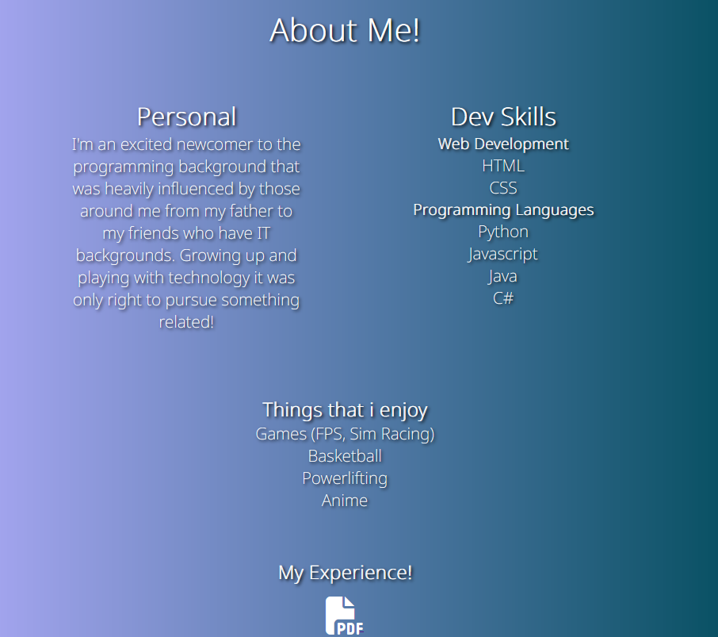
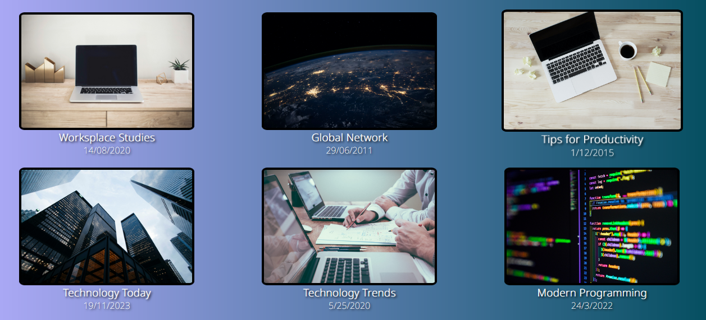

# Albert Dela Rosa - T1A2 Portfolio 

## Overview
This website is a personal portfolio to demonstrate what we have learned in lessons regarding HTML & CSS. My goal is to have a presentable and functional website that showcases myself as well as applying the skills i have developed in web development.

## Components of Website

### Links
Link to [website]([https://teal-youtiao-c496a2.netlify.app] ) and link to [Repository](https://github.com/Delarosa29/AlbertDelaRosa_T1Portfolio).

## Header and Navigation Bar
Created a simple responsive navigation bar using flex. The header contains navigation links to different parts of the website and also includes my name which also functions as a home button. Each nav item has a pseudo element which changes color when cursor is hovered over. At smaller viewports the layout changes to a column style with the nav items below the name.
### Example:



### Header HTML:
```HTML
    <!-- Header semantic  -->
    <header class="header">
        <a href="./index.html" class="homelogo">Albert Dela Rosa</a>
        <!-- Nav semantic  -->
        <nav class="navbar">
            <!-- unordered list semantic  -->
            <ul>
                <a href="./index.html">Home</a>
                <a href="./sites/about.html">About</a>
                <a href="./sites/blog.html">Blog</a>
                <a href="./sites/contact.html">Contact</a>
            </ul>
        </nav>
    </header>
```


## Footer and Socials
Footer contains 3 anchors in forms of icons which are linked from a style website. Icons enlarge with a pseudo element when cursor hovers. The layout style does not change at smaller viewports.

### Example:


### Footer HTML:
```HTML
    <!-- Link for font awesome -->
    <link rel="stylesheet" href="https://cdnjs.cloudflare.com/ajax/libs/font-awesome/6.4.2/css/all.min.css"
        integrity="sha512-z3gLpd7yknf1YoNbCzqRKc4qyor8gaKU1qmn+CShxbuBusANI9QpRohGBreCFkKxLhei6S9CQXFEbbKuqLg0DA=="
        crossorigin="anonymous" referrerpolicy="no-referrer" />
    <!-- Link for font awesome -->

    <!-- Footer semantic  -->
    <footer>
        <p>Connect with me!</p>
        <div class="socials">
            <!-- Anchor icons which re-direct to matching social -->
            <a href="https://github.com/Delarosa29" target="_blank">
                <i class="fa-brands fa-github fa-2x" style="color: #ffffff;"></i>
            </a>
            <a href="https://au.linkedin.com" target="_blank">
                <i class="fa-brands fa-linkedin fa-2x" style="color: #ffffff;"></i>
            </a>
            <a href="https://www.instagram.com" target="_blank">
                <i class="fa-brands fa-instagram fa-2x" style="color: #ffffff;"></i>
            </a>
        </div>
    </footer>
```


## Home Page
The home page contains a small introduction to myself and the website along with a photo. Flexbox was the choice for the layout to keep things simple and has 3 breakpoints which change it into a column style layout as the viewport reduces.

### Example:


### Home HTML:
```HTML
    <main>
        <!-- Main box content containing image and text  -->
        <div class="container">
            <!-- Link to img source  -->
            
            <!-- Class for text items  -->
            <div class="text">
                <h2>Hi!</h2>
                <p>My name is Albert! I'm an aspiring junior developer who's taken my first steps into the world of
                    programming. Here on my website hopefully i can display some of what i've learnt and what type of
                    new skills I'm planning to learn! Have a look around.</p>
            </div>
        </div>
    </main>
```


## About Me Page
The about me includes more information about myself and lists the skills that i'm currently learning on the path to become a programmer with flex being used for the layout. It also includes my hobbies and a little icon serving as a hyperlink to open a new page with a mockup resume. On smaller viewports the layout turns into a column.

### Example:


### About HTML:
```HTML
    <main>
        <!-- h1 semantic -->
        <h1 class="title">About Me!</h1>

        <div class="columns">
            <div>
                <h2>Personal</h2>
                <p>I'm an excited newcomer to the programming background that was heavily influenced by those around me
                    from my father to my friends who have IT backgrounds. Growing up and playing with technology it was
                    only right to pursue something related! </p>
            </div>
            <div>
                <!-- Aside semantic -->
                <aside>
                    <h2>Dev Skills</h2>
                    <!-- ul list semantic -->
                    <ul class="language-list">
                        <h3>Web Development</h3>
                        <li>HTML</li>
                        <li>CSS</li>
                        <h3>Programming Languages</h3>
                        <li>Python</li>
                        <li>Javascript</li>
                        <li>Java</li>
                        <li>C#</li>
                    </ul>
                </aside>
            </div>
            <div>
                <h3>Things that i enjoy</h3>
                <!-- ul semantic list -->
                <ul class="interest-list">
                    <li>Games (FPS, Sim Racing)</li>
                    <li>Basketball</li>
                    <li>Powerlifting</li>
                    <li>Anime</li>
                </ul>
            </div>
        </div>

        <!-- Container for experience and resume  -->
        <div class="pdf">
            <h2>My Experience!</h2>
            <!-- Link that opens resume in new window -->
            <a href="./resume/fakeresume1.pdf" target="_blank">
                <i class="fa-solid fa-file-pdf fa-3x" style="color: #ffffff;"></i>
            </a>
        </div>

    </main>
```

## Blog Landing Page
The blog landing page which showcases 6 blog posts with an image, title and date published. Flex is used to have the layout evenly display at multiple viewports using % scaling values. An #id tag is added to href location directories to automatically jump to location of corresponding blog post in separate page. Blog posts enlarge with when cursor hovers over.

### Example:


### Blogs landing page HTML:
```HTML
    <main>
        <div class="blog">
            <div class="blog-content">
                <!-- a href has an added # at the end of directory to auto jump to element that i have given an id to in the related blog post -->
                <a href="./blogs/blogspage.html#workplace">
                    <!-- Directory for image location  -->
                    
                    <h3>Worksplace Studies</h3>
                    <p>14/08/2020</p>
                </a>
            </div>
            <div class="blog-content">
                <a href="./blogs/blogspage.html#global">
                    <!-- Directory for image location  -->
                    
                    <h3>Global Network</h3>
                </a>
                <p>29/06/2011</p>
            </div>
            <div class="blog-content">
                <a href="./blogs/blogspage.html#tips">
                    <!-- Directory for image location  -->
                    
                    <h3>Tips for Productivity</h3>
                    <p>1/12/2015</p>
                </a>
            </div>
            <div class="blog-content">
                <a href="./blogs/blogspage.html#technology">
                    <!-- Directory for image location  -->
                    
                    <h3>Technology Today</h3>
                    <p>19/11/2023</p>
                </a>
            </div>
            <div class="blog-content">
                <a href="./blogs/blogspage.html#trends">
                    <!-- Directory for image location  -->
                    
                    <h3>Technology Trends</h3>
                    <p>5/25/2020</p>
                </a>
            </div>
            <div class="blog-content">
                <a href="./blogs/blogspage.html#programming">
                    <!-- Directory for image location  -->
                    
                    <h3>Modern Programming</h3>
                    <p>24/3/2022</p>
                </a>
            </div>
        </div>
    </main>
```


## Blog Page
Blog list page includes all blog posts and texts using CSS Grid layout. Uses only 1 HTML page to contain all blog posts rather than opening a different link for each individual blog post. At smaller viewports
```HTML
        <!-- span class to keep h2 a single line element  -->
        <span>
            <!-- title text on top of page -->
            <h2 class="maintitle">Blog Page!</h2>
        </span>
        <!-- Article semantic -->
        <article class="grid-container">
            <!-- Figure semantic -->
            <figure class="image">
                <!-- Directory for photo used -->
                
            </figure>
            <!-- div for main text  -->
            <div class="text">
                <div id="workplace">
                    <!-- blog title and text  -->
                    <h2>Workplace Studies</h2>
                    <p>Lorem ipsum, dolor sit amet consectetur adipisicing elit. At, dolorum, facere iste, facilis
                        aspernatur velit dolores libero vel eligendi labore ipsum ullam fugiat nostrum a? Necessitatibus
                        mollitia veniam expedita similique. Lorem ipsum dolor sit, amet consectetur adipisicing elit.
                        Eligendi nemo repellat cupiditate voluptates obcaecati nesciunt saepe tempora quos consectetur
                        earum, numquam non ipsam itaque quo, eaque dolor maiores ipsa placeat!</p>
                </div>
            </div>
        </article>
```


## Contact page
```HTML
    <main>
        <h2>Contact Me</h2>
        <form>
            <!-- Div for form box  -->
            <div class="form-box">
                <!-- Label for input title  -->
                <label for="name">Name:</label>
                <!-- Type of input is text so user can type  -->
                <input type="text" class="form-input" id="name" placeholder="Your name">
            </div>
            <div class="form-box">
                <label for="email">Email:</label>
                <input type="email" class="form-input" id="email" placeholder="Your email">
            </div>
            <div class="form-box">
                <label for="topic">Topic:</label>
                <input type="text" class="form-input" id="topic" placeholder="Your subject">
            </div>
            <div class="form-box">
                <label for="message">Message:</label>
                <!-- Type of input is a text box so user can put a longer message and size is determined by rows  -->
                <textarea rows="5" class="form-input" id="message" placeholder="Your message" resize="none"></textarea>
            </div>

            <!-- Button element for submission of  -->
            <div id="button">
                <button id="send">Send</button>
            </div>
        </form>

    </main>
```
Contact page includes a contact submission with name, email, subject and message with submit button.

## Sitemap 


Website styling files are all placed in individual folders within components folder. 
#### These folders include:
- Components 
    - Defaults (Styling for header and footer used across website)
        - footer.css
        - header.css
    - Images
        - favicon image and website images
    - Pages (Styling for each individual HTML file)
        - about.css
        - blog.css
        - blogspage.css
        - contact.css
        - home.css
    - Styles (Defined values for colors and media breakpoints)
        - breakpoints.css
        - colors.css